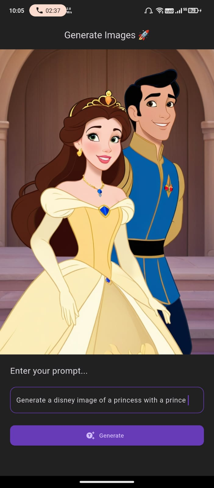

# 🖼️ AI Image Generator App

A Flutter-based mobile application that generates AI-powered images from text prompts.  
Built with **Flutter** and integrated with AI image generation APIs.  

---

## 📸 App Preview

<p align="center">
  
</p>

---

## ✨ Features

- Enter a text prompt and generate AI-based images.
- Simple and beautiful Flutter UI.
- Example: *"Generate a Disney image of a princess with a prince"*.
- Cross-platform support (Android & iOS).

---

## 🚀 Getting Started

This project is a starting point for a Flutter application.

### Prerequisites
- [Flutter SDK](https://docs.flutter.dev/get-started/install)
- Android Studio / VS Code
- A GitHub account
- AI Image Generation API Key (update in your code)

### Run the app
```sh
flutter pub get
flutter run
